# 관광지 조회 API 성능 분석 및 개선 기록

## 1. 테스트 환경

```
데이터 수: attractions 814,640건
실행 환경: Docker Compose, Spring Boot, MySQL 8.4
대상 API: GET /api/attractions
페이지 크기: size=6
측정 방식: AttractionService에서 search 쿼리와 count 쿼리 실행 시간을 분리 로깅
```

성능 테스트를 위해 로컬 Docker MySQL의 `attractions` 데이터를 약 81만 건까지 늘렸다. 관광지 목록 API는 한 페이지에 6개 데이터만 응답하지만, 페이징을 위해 전체 결과 개수인 `totalCount`도 함께 계산한다.

따라서 응답 지연이 실제 목록 조회 때문인지, 전체 개수 계산 때문인지 확인하기 위해 `search` 쿼리와 `count` 쿼리 시간을 분리해서 측정했다.

## 2. 문제 상황

관광지 목록 API는 다음과 같은 응답을 만든다.

```
items       현재 페이지에 보여줄 관광지 목록
page        현재 페이지
size        페이지 크기
totalCount  조건에 맞는 전체 관광지 개수
totalPages  전체 페이지 수
```

즉, 한 번의 목록 요청 안에서 두 종류의 DB 조회가 발생한다.

```
search 쿼리: 현재 페이지에 보여줄 관광지 6개 조회
count 쿼리: 페이징을 위한 전체 결과 개수 조회
```

데이터 수를 81만 건까지 늘린 뒤 일부 조회 요청에서 200~500ms 이상의 응답 시간이 발생했다. 처음에는 목록 조회 자체가 느릴 것이라고 예상했지만, 정확한 원인을 확인하기 위해 두 쿼리 시간을 나누어 측정했다.

## 3. 개선 전 API 응답 시간

테스트 요청:

```
GET /api/attractions?page=1&size=6
GET /api/attractions?sidoCode=1&page=1&size=6
GET /api/attractions?sidoCode=1&gugunCode=23&page=1&size=6
GET /api/attractions?contentTypeIds=12&page=1&size=6
```

측정 결과:

| 조회 조건 | search | count | total |
| --- | --- | --- | --- |
| 전체 조회 | 25ms | 480ms | 506ms |
| 시도 필터 | 13ms | 131ms | 144ms |
| 시도 + 구군 필터 | 12ms | 22ms | 35ms |
| 콘텐츠 타입 필터 | 21ms | 202ms | 223ms |

[이미지: 개선 전 Docker 로그 캡처]

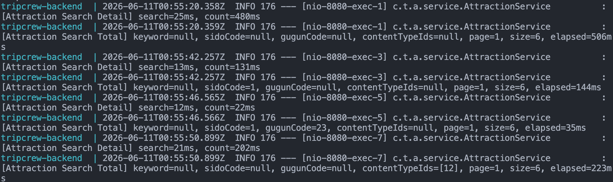

## 4. 1차 분석

목록에 실제로 표시되는 6개 데이터를 조회하는 `search` 쿼리는 12~25ms로 빠르게 수행되었다.

반면 페이징을 위해 전체 결과 개수를 계산하는 `count` 쿼리는 전체 조회 기준 480ms, 콘텐츠 타입 필터 기준 202ms가 소요되었다.

특히 전체 조회의 경우 `total=506ms` 중 `count=480ms`가 대부분을 차지했다. 이를 통해 관광지 목록 조회의 1차 병목은 목록 데이터 조회가 아니라 `totalCount` 계산이라고 판단했다.

## 5. MySQL 직접 측정

Spring/MyBatis 계층의 영향을 제외하고 DB 쿼리 자체의 실행 시간을 확인하기 위해 MySQL에서 직접 쿼리를 실행했다.

### 5-1. 데이터 수 확인

```sql
SELECT COUNT(*) AS attraction_count
FROM attractions;
```

[이미지: attractions 데이터 수 캡처]

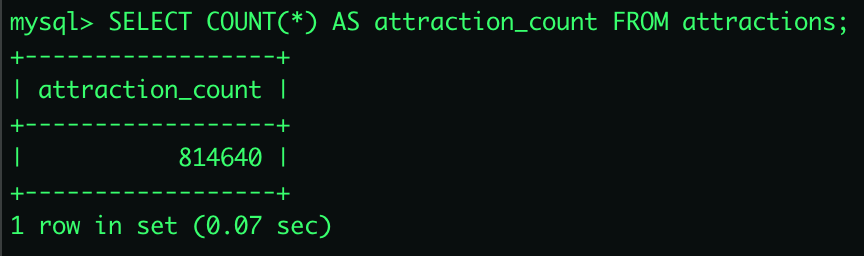

### 5-2. JOIN 포함 COUNT 측정

기존 `count` 쿼리는 목록 조회용 JOIN 구조를 공유하고 있었다.

```sql
SELECT COUNT(*) AS join_count
FROM attractions a
LEFT JOIN sidos s ON a.area_code = s.sido_code
LEFT JOIN guguns g ON a.area_code = g.sido_code
               AND a.si_gun_gu_code = g.gugun_code
LEFT JOIN contenttypes ct ON a.content_type_id = ct.content_type_id;
```

[이미지: JOIN 포함 COUNT 실행 시간 캡처]

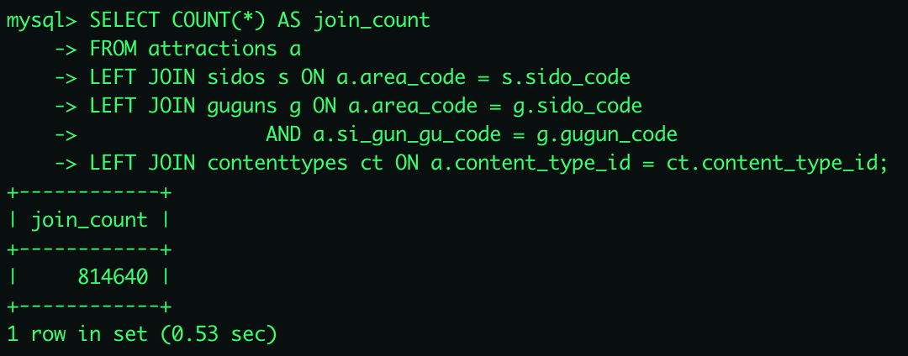

### 5-3. attractions 단독 COUNT 측정

```sql
SELECT COUNT(*) AS simple_count
FROM attractions a;
```

[이미지: attractions 단독 COUNT 실행 시간 캡처]

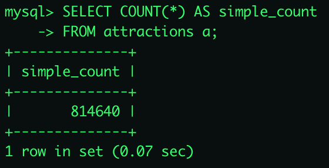

### 5-4. 목록 조회 쿼리 측정

목록 조회는 화면 표시를 위해 지역명, 구군명, 콘텐츠 타입명을 함께 조회해야 하므로 JOIN이 필요하다.

```sql
SELECT
    a.no,
    a.title,
    s.sido_name AS sido,
    g.gugun_name AS gugun,
    ct.content_type_name AS content_type
FROM attractions a
LEFT JOIN sidos s ON a.area_code = s.sido_code
LEFT JOIN guguns g ON a.area_code = g.sido_code
               AND a.si_gun_gu_code = g.gugun_code
LEFT JOIN contenttypes ct ON a.content_type_id = ct.content_type_id
ORDER BY a.no DESC
LIMIT 6 OFFSET 0;
```

[이미지: 목록 6개 조회 실행 시간 캡처]

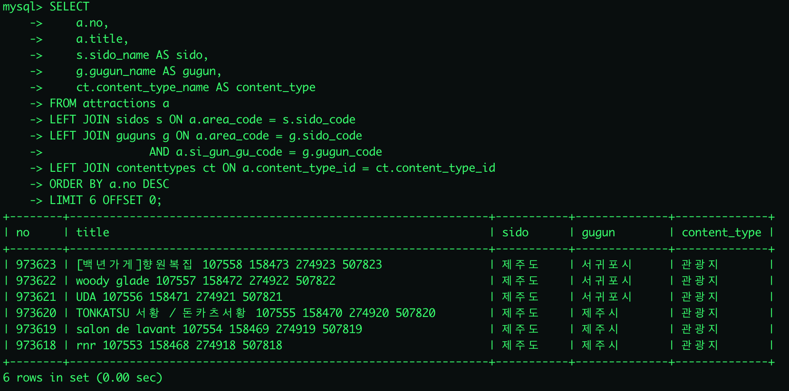

목록 조회는 JOIN을 포함하더라도 `LIMIT 6`으로 6개 row만 조회하기 때문에 빠르게 수행되었다.

### 5-5. EXPLAIN 확인

```sql
EXPLAIN
SELECT
    a.no,
    a.title,
    s.sido_name AS sido,
    g.gugun_name AS gugun,
    ct.content_type_name AS content_type
FROM attractions a
LEFT JOIN sidos s ON a.area_code = s.sido_code
LEFT JOIN guguns g ON a.area_code = g.sido_code
               AND a.si_gun_gu_code = g.gugun_code
LEFT JOIN contenttypes ct ON a.content_type_id = ct.content_type_id
ORDER BY a.no DESC
LIMIT 6 OFFSET 0;
```

[이미지: 목록 조회 EXPLAIN 캡처]

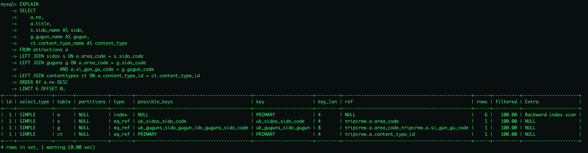

실행 계획상 `attractions` 테이블은 `PRIMARY` 인덱스를 사용했고, `ORDER BY no DESC LIMIT 6`은 역방향 인덱스 스캔으로 처리되었다. 따라서 목록 조회 자체는 효율적으로 수행되고 있음을 확인했다.

## 6. 원인 정리

조회 결과를 화면에 보여주기 위한 `search` 쿼리는 다음 정보가 필요하다.

```
관광지 제목
시도명
구군명
콘텐츠 타입명
주소
이미지
위도/경도
```

따라서 `search` 쿼리에서는 `sidos`, `guguns`, `contenttypes` 테이블과의 JOIN이 필요하다.

하지만 `count` 쿼리는 페이징을 위한 전체 개수만 계산하면 된다. `sido_name`, `gugun_name`, `content_type_name` 같은 표시용 데이터가 필요하지 않다.

그럼에도 기존 `count` 쿼리는 목록 조회용 JOIN 구조를 그대로 사용하고 있었기 때문에 불필요한 JOIN 비용이 발생했다.

## 7. 개선 방향

`search` 쿼리와 `count` 쿼리의 목적을 분리한다.

```
search 쿼리
- 화면 표시용 데이터가 필요하므로 JOIN 유지

count 쿼리
- 전체 개수만 필요하므로 attractions 테이블 기준으로 계산
- 불필요한 sidos, guguns, contenttypes JOIN 제거
```

기존 구조:

```sql
SELECT COUNT(*)
FROM attractions a
LEFT JOIN sidos ...
LEFT JOIN guguns ...
LEFT JOIN contenttypes ...
WHERE ...
```

개선 구조:

```sql
SELECT COUNT(*)
FROM attractions a
WHERE ...
```

필터 조건은 모두 `attractions` 테이블 컬럼으로 처리할 수 있다.

```
area_code
si_gun_gu_code
content_type_id
title
addr1
addr2
```

## 8. count 쿼리 최적화 적용

MyBatis Mapper에서 `WHERE` 조건은 공통으로 재사용하고, `search`와 `count`의 FROM 절을 분리했다.

```
attractionSearchFrom
- attractions + sidos + guguns + contenttypes JOIN
- 화면 표시용 목록 조회에 사용

attractionCountFrom
- attractions 단독 조회
- totalCount 계산에 사용

attractionWhere
- keyword, sidoCode, gugunCode, contentTypeIds 조건 공통 재사용
```

[이미지: 수정한 AttractionMapper.xml 코드 캡처]

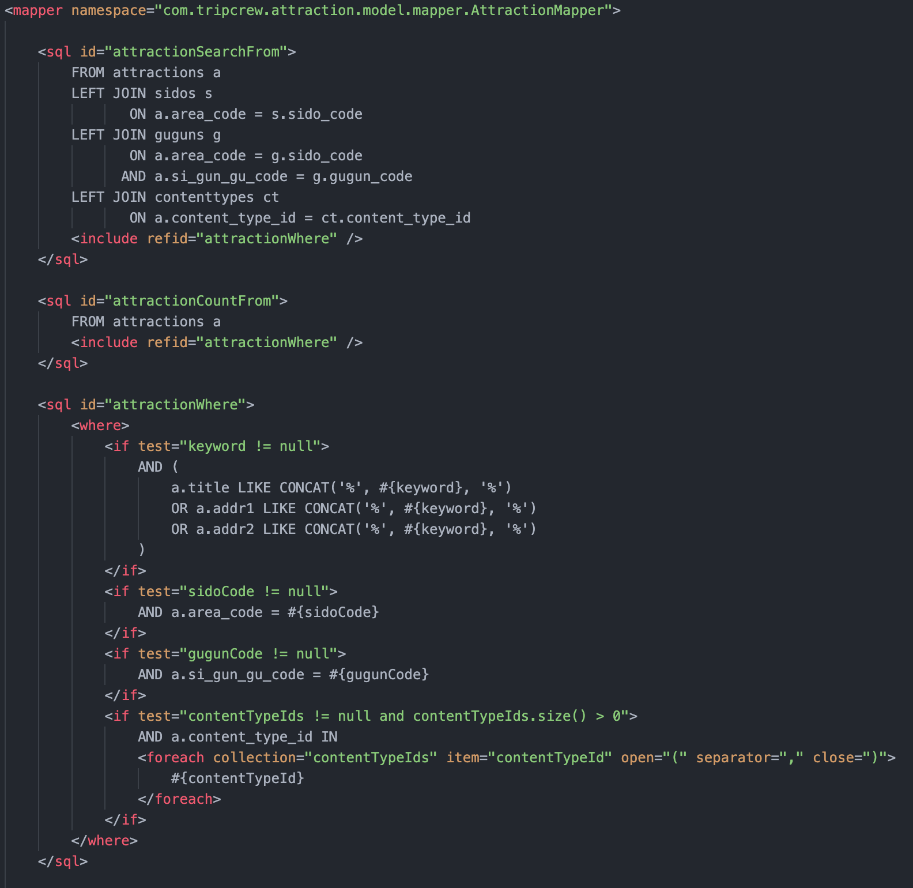

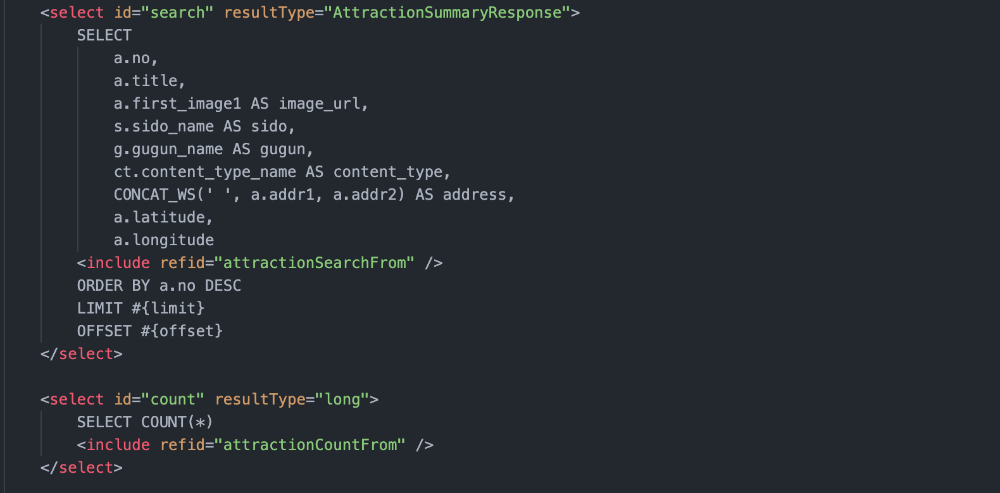

## 9. 개선 후 API 응답 시간

동일한 조건으로 다시 API 응답 시간을 측정했다.

테스트 요청:

```
GET /api/attractions?page=1&size=6
GET /api/attractions?sidoCode=1&page=1&size=6
GET /api/attractions?sidoCode=1&gugunCode=23&page=1&size=6
GET /api/attractions?contentTypeIds=12&page=1&size=6
```

개선 후 측정 결과:

| 조회 조건 | search | count | total |
| --- | --- | --- | --- |
| 전체 조회 | 5ms | 46ms | 52ms |
| 시도 필터 | 6ms | 15ms | 22ms |
| 시도 + 구군 필터 | 8ms | 8ms | 16ms |
| 콘텐츠 타입 필터 | 20ms | 18ms | 38ms |

[이미지: 개선 후 Docker 로그 캡처]

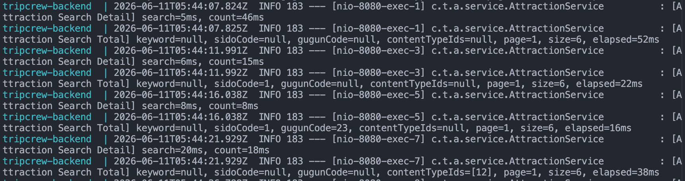

## 10. 개선 전후 비교

| 조회 조건 | 개선 전 total | 개선 후 total | 감소율 |
| --- | --- | --- | --- |
| 전체 조회 | 506ms | 52ms | 약 89.7% |
| 시도 필터 | 144ms | 22ms | 약 84.7% |
| 시도 + 구군 필터 | 35ms | 16ms | 약 54.3% |
| 콘텐츠 타입 필터 | 223ms | 38ms | 약 83.0% |

count 쿼리에서 불필요한 JOIN을 제거한 결과, 전체 조회와 필터 조회의 응답 시간이 크게 개선되었다.

특히 전체 조회는 506ms에서 52ms로 감소했고, 콘텐츠 타입 필터 조회는 223ms에서 38ms로 감소했다. 이를 통해 기존 병목이 목록 데이터 조회가 아니라, 페이징을 위한 `totalCount` 계산 과정에 있었음을 확인할 수 있었다.

이번 개선은 기능 변경 없이 쿼리 구조만 분리한 개선이다.

```
기능 결과
- items 동일
- totalCount 동일
- totalPages 동일

내부 처리
- search 쿼리는 JOIN 유지
- count 쿼리는 불필요한 JOIN 제거
```

## 11. 추가 발견: 키워드 검색 병목

count 쿼리 최적화 이후 일반 목록/필터 조회는 개선되었지만, 키워드 검색에서는 여전히 높은 응답 시간이 발생했다.

테스트 요청:

```
GET /api/attractions?keyword=제주&page=1&size=6
GET /api/attractions?keyword=서울&page=1&size=6
```

측정 결과:

| 키워드 | search | count | total |
| --- | --- | --- | --- |
| 제주 | 465ms | 356ms | 821ms |
| 서울 | 604ms | 350ms | 954ms |

[이미지: 키워드 검색 Docker 로그 캡처]

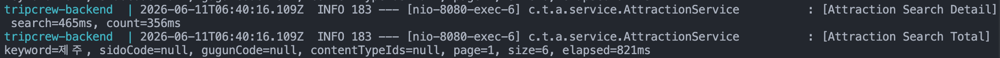

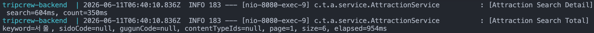

키워드 검색은 다음 조건으로 수행된다.

```sql
WHERE a.title LIKE '%keyword%'
   OR a.addr1 LIKE '%keyword%'
   OR a.addr2 LIKE '%keyword%'
```

이 방식은 검색어 앞뒤에 `%`가 붙는 부분 일치 검색이다. 일반적인 B-tree 인덱스는 앞부분이 고정된 검색에는 유리하지만, `LIKE '%keyword%'`처럼 앞에 와일드카드가 붙은 검색에는 효율적으로 사용되기 어렵다.

따라서 키워드 검색에서는 `LIMIT 6`으로 6개만 응답하더라도, MySQL이 조건에 맞는 데이터를 찾기 위해 많은 row를 검사하게 된다. 이 때문에 키워드 검색에서는 `search`와 `count` 모두 높은 시간이 소요되었다.

## 12. 키워드 검색 이후 초기화 지연 분석

추가로 키워드 검색 직후 초기화 요청이 느려지는 현상도 확인했다.

로그 패턴:

```
keyword=서울
- search: 604ms
- count: 350ms
- total: 954ms

이후 초기화 요청
- keyword=null
- search: 981ms
- count: 44ms
- total: 1025ms

- keyword=null
- search: 893ms
- count: 42ms
- total: 935ms

- keyword=null
- search: 902ms
- count: 39ms
- total: 941ms

keyword=제주
- search: 465ms
- count: 356ms
- total: 821ms

이후 초기화 요청
- keyword=null
- search: 994ms
- count: 40ms
- total: 1034ms

- keyword=null
- search: 936ms
- count: 39ms
- total: 975ms

- keyword=null
- search: 960ms
- count: 43ms
- total: 1003ms
```

[이미지: 키워드 검색 직후 초기화 지연 로그 캡처]

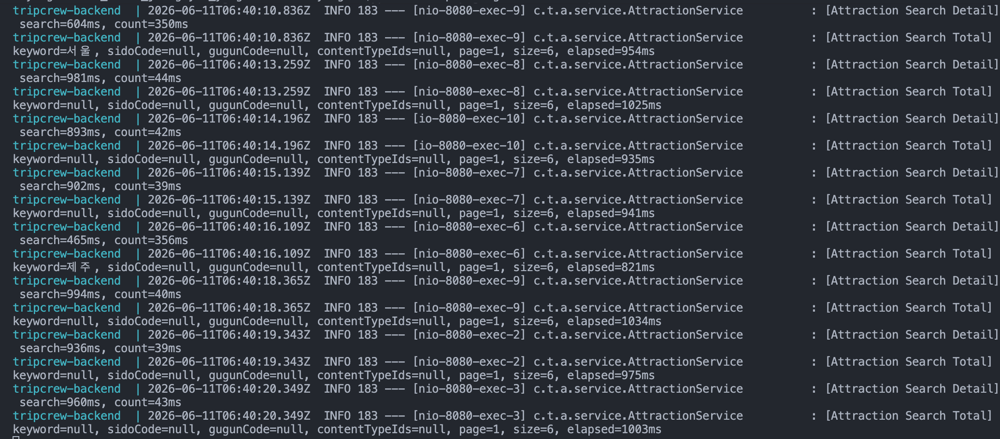

이를 통해 초기화 쿼리 자체가 항상 느린 것이 아니라, 무거운 키워드 검색 요청 이후 전체조회 요청이 함께 지연되는 패턴을 확인했다.

특히 keyword=서울, keyword=제주 검색은 LIKE '%keyword%' 조건으로 많은 row를 검사한다. 이 요청들이 DB 자원을 오래 사용한 직후에는 keyword=null인 초기화 요청에서도 search 시간이 900~1000ms대로 증가했다.

반면 키워드 검색 부하가 사라진 뒤 동일한 초기화 요청은 다시 수십 ms대로 처리되었다. 따라서 키워드 검색은 단순히 해당 요청만 느리게 만드는 것이 아니라, 이어지는 전체조회 요청의 지연에도 영향을 줄 수 있다고 판단했다.

## 13. 이후 개선 방향

이번 단계에서는 일반 목록/필터 조회의 병목이었던 count 쿼리를 개선했다.

다만 키워드 검색은 LIKE 기반 검색의 구조적 한계가 확인되었으므로 별도의 개선이 필요하다.

### 프론트 요청 방식 관찰

프론트에는 debounce가 적용되어 있어 빠르게 `서울`을 입력하면 중간 키워드인 `서` 요청은 발생하지 않고 최종 키워드인 `서울` 요청만 전송되는 것을 확인했다.

하지만 사용자가 천천히 입력하는 경우에는 debounce 대기 시간이 지난 뒤 `서` 같은 한 글자 키워드 요청이 발생할 수 있다.

따라서 debounce만으로는 검색 범위가 넓은 한 글자 키워드 요청을 완전히 방지할 수 없다. 키워드 검색 부하를 줄이기 위해서는 최소 검색어 길이 제한을 함께 적용하는 것이 필요하다.

```
debounce
- 빠른 연속 입력 중 발생하는 불필요한 중간 요청을 줄임

최소 검색어 길이 제한
- 천천히 입력해도 한 글자 키워드 검색 자체를 방지함
```

```
1. 최소 검색어 길이 제한
   - 예: 2글자 이상일 때만 키워드 검색 수행
   - keyword=서 같은 넓은 검색 방지

2. 프론트 debounce 및 이전 요청 취소
   - 입력할 때마다 즉시 요청하지 않고 300~500ms 지연
   - 새 검색 또는 초기화 시 이전 키워드 요청 취소

3. MySQL FULLTEXT INDEX 적용 검토
   - title, addr1, addr2 컬럼 대상
   - MATCH ... AGAINST 검색으로 전환

4. 인기 키워드 Redis 캐싱
   - 반복 조회가 많은 키워드 결과를 cache-aside 방식으로 저장
   - 동일 키워드 재요청 시 DB 조회 부담 감소

5. 검색 전용 엔진 도입 검토
   - Elasticsearch 또는 OpenSearch
   - 검색 품질, 형태소 분석, 랭킹이 중요해질 경우 검토
```

## 14. 성능 측정 시 주의점

로컬 Docker 환경에서는 요청 시간이 항상 일정하지 않았다. MySQL 버퍼 풀 상태, Docker Desktop 리소스, 첫 요청 워밍업, 동시에 들어온 API 요청에 따라 같은 조건에서도 응답 시간이 튈 수 있었다.

따라서 단일 요청 1회의 절대값만으로 성능을 판단하지 않고, 같은 요청을 여러 번 반복 측정해 개선 전후의 경향을 비교하는 것이 적절하다.

포트폴리오 기록에서는 다음 기준을 함께 남기는 것이 좋다.

```
- 첫 요청은 워밍업 값으로 분리
- 동일 요청을 여러 번 반복 측정
- 평균뿐 아니라 중앙값 또는 대표값 기록
- 튄 값이 있다면 원인 후보를 함께 기록
```

## 15. 최종 정리

이번 성능 개선 과정에서는 Redis 캐싱을 먼저 도입하지 않고, 실제 병목을 측정한 뒤 쿼리 구조를 먼저 개선했다.

분석 결과, 일반 목록/필터 조회의 주요 병목은 목록 데이터 조회가 아니라 페이징을 위한 `count` 쿼리였다. `count` 쿼리에서 불필요한 JOIN을 제거한 결과, 전체 조회는 506ms에서 52ms로, 콘텐츠 타입 필터는 223ms에서 38ms로 개선되었다.

반면 키워드 검색은 `LIKE '%keyword%'` 방식으로 인해 `search`와 `count` 모두 많은 row를 검사하는 문제가 확인되었다. 특히 한 글자 검색어처럼 범위가 넓은 키워드 검색은 이후 초기화 요청까지 지연시킬 수 있었다.

따라서 키워드 검색은 단순 JOIN 제거만으로 해결하기 어렵고, 최소 검색어 길이 제한, debounce, 요청 취소, FULLTEXT INDEX, Redis 캐싱, 검색 엔진 도입 등의 추가 개선이 필요하다고 판단했다.

이번 개선을 통해 캐싱 적용 전 데이터베이스 쿼리 병목을 먼저 분석하고, 기능 변경 없이 쿼리 구조를 개선해 응답 시간을 줄일 수 있었다.
