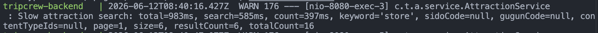
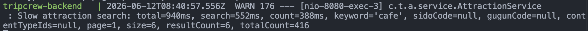
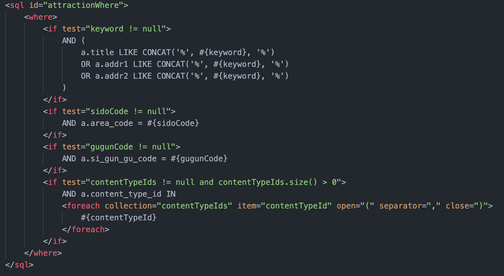
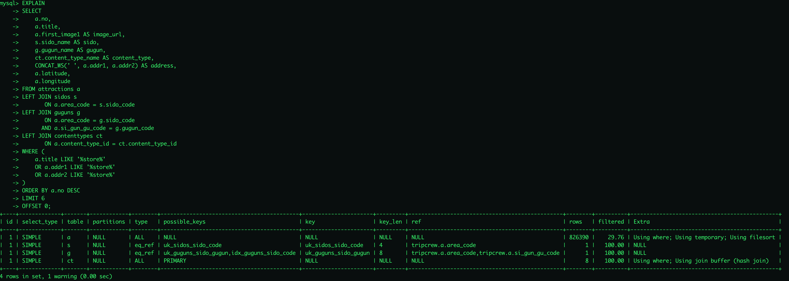

# 관광지 키워드 검색 성능 분석 기록

> 대상: MySQL 8.4 / InnoDB / utf8mb4 · Spring Boot 3.3 + MyBatis
> 목적: count 쿼리 최적화 이후 남은 키워드 검색 병목 분석과 후속 개선 기록

## 0. 배경

선행 작업에서는 관광지 목록/필터 조회의 주요 병목이 `count` 쿼리의 불필요한 JOIN임을 확인하고, `search` 쿼리와 `count` 쿼리의 FROM 절을 분리했다.

선행 문서:

- [관광지 조회 API 성능 분석 및 개선 기록](./attraction-query-optimization.md)

그 결과 일반 목록/필터 조회는 크게 개선되었다.

| 조회 조건 | 개선 전 total | 개선 후 total | 감소율 |
|-----------|--------------:|--------------:|-------:|
| 전체 조회 | 506ms | 52ms | 약 89.7% |
| 시도 필터 | 144ms | 22ms | 약 84.7% |
| 시도 + 구군 필터 | 35ms | 16ms | 약 54.3% |
| 콘텐츠 타입 필터 | 223ms | 38ms | 약 83.0% |

하지만 이후 키워드 검색 요청에서 다시 900ms대 응답 지연이 발생했다. 따라서 이번 문서에서는 선행 개선 이후에도 남아 있던 `keyword` 검색 병목을 별도로 분석한다.

## 1. 문제 상황

관광지 검색 API에서 키워드 검색 시 응답 지연이 발생했다. 서비스 레이어에 구간별 성능 로그를 추가해 전체 처리 시간, 목록 조회 쿼리 시간, count 쿼리 시간을 분리해서 측정했다.

측정 결과 키워드 검색에서는 `search` 쿼리와 `count` 쿼리가 모두 느렸고, 그중 `search` 쿼리가 가장 큰 병목으로 확인됐다.

| keyword | total | search | count | resultCount | totalCount |
|---------|------:|-------:|------:|------------:|-----------:|
| store | 983ms | 585ms | 397ms | 6 | 16 |
| cafe | 940ms | 552ms | 388ms | 6 | 416 |

캡처 자료:

- Slow attraction search 로그: `store`



- Slow attraction search 로그: `cafe`



## 2. 현재 검색 SQL

현재 키워드 검색은 `title`, `addr1`, `addr2` 세 컬럼에 `LIKE '%keyword%'` 조건을 OR로 적용한다. count 쿼리의 JOIN은 이미 제거했지만, 키워드 조건 자체는 `search`와 `count`에서 공통으로 사용된다.

```sql
a.title LIKE CONCAT('%', #{keyword}, '%')
OR a.addr1 LIKE CONCAT('%', #{keyword}, '%')
OR a.addr2 LIKE CONCAT('%', #{keyword}, '%')
```

목록 조회(`search`)는 검색 조건에 더해 화면 표시용 지역명/구군명/콘텐츠 타입명을 가져오기 위해 조인을 수행한다.

```sql
FROM attractions a
LEFT JOIN sidos s
       ON a.area_code = s.sido_code
LEFT JOIN guguns g
       ON a.area_code = g.sido_code
      AND a.si_gun_gu_code = g.gugun_code
LEFT JOIN contenttypes ct
       ON a.content_type_id = ct.content_type_id
```

캡처 자료:

- `AttractionMapper.xml`의 `LIKE '%keyword%'` 검색 조건



- `AttractionMapper.xml`의 `search` 쿼리 조인 구조


## 3. 실행 계획 확인

`EXPLAIN`으로 현재 검색 쿼리의 실행 계획을 확인했다.

### 3.1 store

```sql
EXPLAIN
SELECT
    a.no,
    a.title,
    a.first_image1 AS image_url,
    s.sido_name AS sido,
    g.gugun_name AS gugun,
    ct.content_type_name AS content_type,
    CONCAT_WS(' ', a.addr1, a.addr2) AS address,
    a.latitude,
    a.longitude
FROM attractions a
LEFT JOIN sidos s
       ON a.area_code = s.sido_code
LEFT JOIN guguns g
       ON a.area_code = g.sido_code
      AND a.si_gun_gu_code = g.gugun_code
LEFT JOIN contenttypes ct
       ON a.content_type_id = ct.content_type_id
WHERE (
    a.title LIKE '%store%'
    OR a.addr1 LIKE '%store%'
    OR a.addr2 LIKE '%store%'
)
ORDER BY a.no DESC
LIMIT 6
OFFSET 0;
```



### 3.2 cafe

```sql
EXPLAIN
SELECT
    a.no,
    a.title,
    a.first_image1 AS image_url,
    s.sido_name AS sido,
    g.gugun_name AS gugun,
    ct.content_type_name AS content_type,
    CONCAT_WS(' ', a.addr1, a.addr2) AS address,
    a.latitude,
    a.longitude
FROM attractions a
LEFT JOIN sidos s
       ON a.area_code = s.sido_code
LEFT JOIN guguns g
       ON a.area_code = g.sido_code
      AND a.si_gun_gu_code = g.gugun_code
LEFT JOIN contenttypes ct
       ON a.content_type_id = ct.content_type_id
WHERE (
    a.title LIKE '%cafe%'
    OR a.addr1 LIKE '%cafe%'
    OR a.addr2 LIKE '%cafe%'
)
ORDER BY a.no DESC
LIMIT 6
OFFSET 0;
```


### 3.3 EXPLAIN 결과 요약

두 키워드 모두 `attractions` 테이블에서 인덱스를 사용하지 못하고 전체 스캔이 발생했다.

| keyword | table | type | possible_keys | key | rows | Extra |
|---------|-------|------|---------------|-----|-----:|-------|
| store | a | ALL | NULL | NULL | 826390 | Using where; Using temporary; Using filesort |
| cafe | a | ALL | NULL | NULL | 826390 | Using where; Using temporary; Using filesort |

해석:

- `type = ALL`: `attractions` 테이블 전체 스캔
- `key = NULL`: 검색에 사용된 인덱스 없음
- `rows = 826390`: 약 82만 건 스캔 예상
- `Using temporary`: 정렬/처리를 위한 임시 테이블 사용
- `Using filesort`: `ORDER BY a.no DESC` 처리에 추가 정렬 비용 발생

## 4. 원인 판단

검색 지연의 주요 원인은 `LIKE '%keyword%'` 조건이다. 앞쪽에 `%`가 붙은 포함 검색은 일반 B-Tree 인덱스를 효율적으로 사용할 수 없고, 현재 검색 대상이 `title`, `addr1`, `addr2` 세 컬럼 OR 조건으로 묶여 있어 스캔 범위가 커진다.

결과적으로 목록 조회 시 다음 비용이 함께 발생한다.

- `attractions` 전체 스캔
- 세 문자열 컬럼에 대한 포함 검색
- 지역/구군/콘텐츠 타입 조인
- `ORDER BY a.no DESC` 정렬
- 페이지네이션을 위한 `LIMIT/OFFSET`

선행 작업에서 count 쿼리의 불필요한 JOIN은 제거되었지만, `LIKE '%keyword%'` 조건은 여전히 `attractions` 테이블의 많은 row를 검사하게 만든다. 따라서 이번 병목은 JOIN 제거만으로 해결하기 어려운 문자열 검색 방식의 문제로 분류한다.

## 5. 개선 후보

| 후보 | 내용 | 장점 | 단점 |
|------|------|------|------|
| 검색 대상 축소 | 우선 `title`만 검색 | 구현이 단순하고 즉시 빨라질 수 있음 | 주소 검색 기능 축소 |
| Prefix 검색 | `LIKE 'keyword%'` + 일반 인덱스 | B-Tree 인덱스 활용 가능 | 중간 포함 검색 불가 |
| FULLTEXT 검색 | `FULLTEXT(title, addr1, addr2)` + `MATCH AGAINST` | 문자열 검색 전용 인덱스 활용, 포트폴리오 설명 가치 높음 | 한국어 검색은 ngram parser 등 추가 고려 필요 |

현재 프로젝트의 포트폴리오 가치와 성능 개선 경험을 고려하면 `FULLTEXT` 인덱스 기반 개선을 우선 검토한다. 다만 한국어 검색까지 안정적으로 다루려면 MySQL `ngram parser`, 최소 검색어 길이, 프론트 debounce/요청 취소 정책도 함께 검토해야 한다.

## 6. 다음 단계

- [x] 서비스 레이어 성능 로그 추가
- [x] 개선 전 slow search 로그 캡처
- [x] 개선 전 `EXPLAIN` 캡처
- [ ] 최소 검색어 길이 정책 검토
- [ ] FULLTEXT 인덱스 migration 작성
- [ ] Mapper 검색 조건을 `MATCH AGAINST`로 변경
- [ ] 개선 후 같은 키워드(`store`, `cafe`)로 성능 재측정
- [ ] 개선 전후 수치 비교
- [ ] README 또는 별도 docs에 최종 정리

## 7. 개선 후 측정 기록

아직 미측정.

| keyword | before search | after search | before total | after total | memo |
|---------|--------------:|-------------:|-------------:|------------:|------|
| store | 585ms | - | 983ms | - | - |
| cafe | 552ms | - | 940ms | - | - |

## 8. 현재 결론

1차 최적화로 일반 목록/필터 조회의 count 병목은 해결했다. 그러나 키워드 검색은 `LIKE '%keyword%'` 기반 부분 일치 검색 때문에 여전히 전체 스캔이 발생한다.

따라서 키워드 검색 개선은 다음 단계의 독립된 성능 개선 작업으로 진행한다. 이 작업은 단순 쿼리 분리보다 검색 인덱스 설계, 검색 정책, 사용자 입력 제어까지 함께 다루는 후속 개선 과제로 기록한다.
